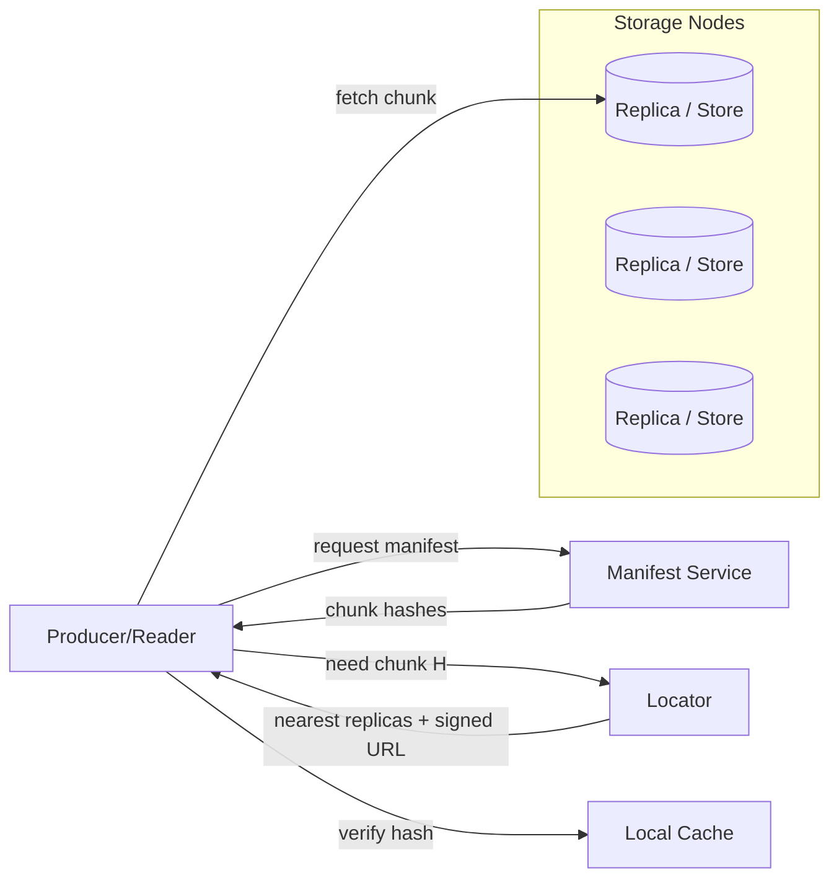

# Architecture (High Level)

Key properties:
- Content-addressed: chunks named by hash; integrity verifiable end-to-end.
- Immutable versions: manifests are append-only; old versions remain.
- Nearest-replica routing: minimize latency/egress; fallback to origin.
- Caching: local cache serves repeat reads; write-through policies optional.
- Fault tolerance: erasure coding within a failure domain; replica spread across zones/regions.

Physical components (see docs/hardware-plan.md)
- Edge cache nodes with NVMe
- Storage nodes with HDD capacity + NVMe journal
- Lightweight control plane for manifest + locator

See also: `docs/pillars/data/manifest-spec.md`, `docs/pillars/data/locator-design.md`, `docs/pillars/data/cache-design.md`.
