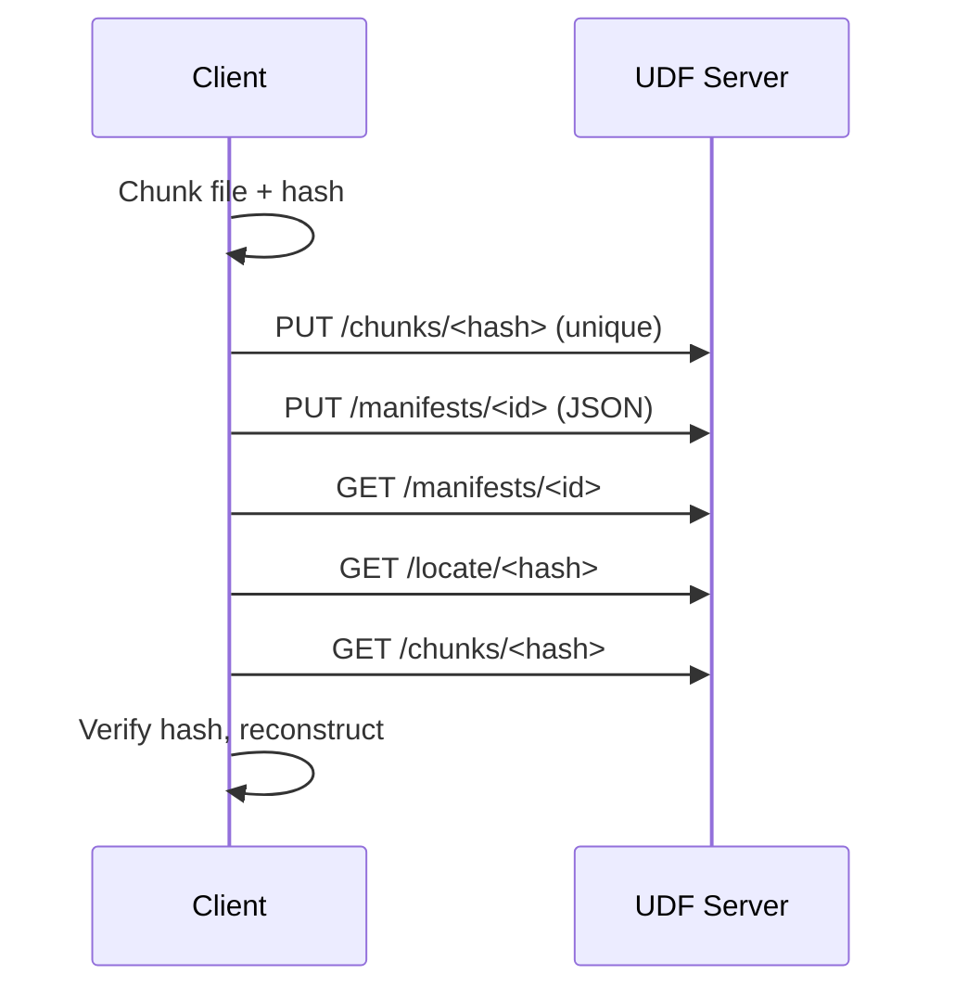

# Reference Implementation (Minimal Python)

This prototype demonstrates UDF concepts end-to-end without external dependencies.

- Server: `python ref/server.py --root .udf_store --port 8080`
- Push file: `python ref/client.py push examples/data/sample1.txt --server http://localhost:8080`
- Fetch back: `python ref/client.py fetch <manifest_id> --server http://localhost:8080 -o out.txt`

Endpoints (server)
- `PUT /chunks/<hash>` raw bytes; idempotent
- `GET /chunks/<hash>` returns bytes
- `PUT /manifests/<id>` JSON manifest
- `GET /manifests/<id>` JSON manifest
- `GET /locate/<hash>` returns candidates (stub returns self)
- `GET /health` health probe

Limitations
- Fixed-size chunking; no CDC yet
- Single-node store; no erasure coding in prototype
- Locator is a stub

Next steps in code
- Add CDC option, simple cache dir, and integrity metrics
- Multi-node demo with two servers and cross-locate

